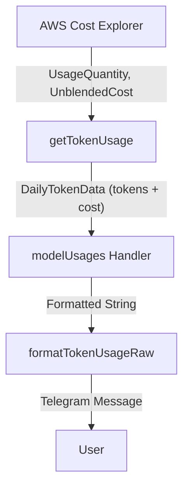

# Requirements

### Overview & Goals
The goal is to enhance the Amazon Bedrock usage report (`/usage_bedrock`) by adding cost information for each model usage type and a total daily cost. This will provide better visibility into which models are driving costs.

### Scope
- **In Scope:**
    - Updating AWS Cost Explorer queries to fetch cost metrics for Bedrock.
    - Modifying data structures to store cost information.
    - Updating the Telegram report layout to display costs in a table format.
    - Formatting the breakdown as a table with aligned columns (Model, Tokens, Cost).
- **Out of Scope:**
    - Adding costs to other reports (e.g., EC2) beyond what is already there.
    - Changing the granularity of the report (staying at daily).

### User Stories
- As a bot admin, I want to see how much each Bedrock model costs me daily, so I can optimize my usage and budget.

# Technical Design

### Current Implementation
- `src/aws/bedrock-usage.ts` fetches token usage (`UsageQuantity`) from AWS Cost Explorer, grouped by `USAGE_TYPE`.
- `src/aws/routes/cost-handler.ts` formats this data into a Telegram message, showing only token counts.
- Model names are currently shown as raw AWS usage types (e.g., `USW2-Bedrock:Input-Tokens-Claude-3-Sonnet`).

### Proposed Changes
- **Data Fetching:**
    - Update the `GetCostAndUsageCommand` in `getTokenUsage` to request `['UsageQuantity', 'UnblendedCost']`.
    - Apply `createGrossCostFilter` (moved from `cost-explorer.ts` to be exported) to filter out credits and ensure accurate cost reporting.
- **Data Model:**
    - Add `cost: number` to `TokenBreakdown`.
    - Add `totalCost: number` to `DailyTokenData`.
- **UI / Formatting:**
    - In `formatTokenUsageRaw`, calculate the sum of costs from the breakdown.
    - Add a "Total Daily Cost" line to the report header.
    - Format the breakdown as a table using `FormattedString.pre` for alignment:
        - Columns: `Model`, `Tokens`, `Cost`.
        - Headers for clarity.
        - Right-aligned numbers for tokens and costs.
    - Keep full model usage names (no shortening) as requested to ensure clear identification of models.

### Architecture Diagram

### File Structure
- `src/aws/cost-explorer.ts`: Export `createGrossCostFilter`.
- `src/aws/bedrock-usage.ts`: Update query and interfaces.
- `src/aws/routes/cost-handler.ts`: Update report formatting logic.

# Delivery Steps

### ✓ Step 1: Enhance Bedrock usage data fetching with cost metrics
Export the `createGrossCostFilter` utility and update the Bedrock data fetching logic.
- Export `createGrossCostFilter` from `src/aws/cost-explorer.ts` to allow its use in Bedrock-specific queries.
- Update `getTokenUsage` in `src/aws/bedrock-usage.ts` to include `UnblendedCost` in the AWS Cost Explorer query metrics.
- Modify `TokenBreakdown` and `DailyTokenData` interfaces in `src/aws/bedrock-usage.ts` to include `cost` and `totalCost` fields.
- Apply `createGrossCostFilter` to the Bedrock usage query to ensure results exclude credits.
- Improve error handling in `getTokenUsage` to return an empty array if no results are found.

### ✓ Step 2: Update usage report formatting and handler
Update the report formatting to include costs and improve readability.
- Modify `formatTokenUsageRaw` in `src/aws/routes/cost-handler.ts` to calculate and display the total daily cost using `toUSD`.
- Update the breakdown list to display a formatted table with Model, Tokens, and Cost columns using full usage type names.
- Use manual padding and mono-spaced formatting (`FormattedString.pre`) to ensure columns align perfectly in the Telegram message.
- Ensure the `modelUsages` handler gracefully handles cases where no data is returned for the requested day.