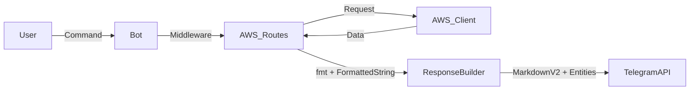

# Requirements

### Overview & Goals
The goal is to improve the visual presentation and reliability of AWS-related messages (EC2 status, Bedrock usage, and costs) in the Telegram bot and ensure the system is well-tested. Currently, the bot uses basic Markdown (V1) which is prone to parsing errors, and several key routes lack automated tests.

### Scope
- **In Scope**:
    - Migration of `src/aws/routes/cost-handler.ts` and `src/aws/routes/ec2-handler.ts` to `MarkdownV2`.
    - Standardization on `@grammyjs/parse-mode` for all AWS responses.
    - Improved layout for EC2 instances (emojis, alignment).
    - Monospaced table-like layouts for daily costs and token usage breakdown.
    - Fix for formatting loss in `src/middleware/routes/bots.ts`.
    - **New**: Comprehensive unit tests for AWS route formatters and formatting utilities.
- **Out of Scope**:
    - Adding new AWS metrics or changing how data is fetched.
    - Modifying Replicate or Finance handlers unless strictly necessary for consistency.
    - Unit tests for Replicate middleware.
    - Full end-to-end integration tests requiring real AWS credentials.

### Functional Requirements
- **EC2 Status**: Must show instance name (bold), ID (code), State (emoji + text), and Public IP (code).
- **Daily Costs**: Must be presented as a monospaced block where dates and costs align vertically.
- **Model Usage**: Must show a clear breakdown of tokens per usage type with total sum at the top.
- **Resilience**: The bot must not fail to send messages if special characters (like `$`, `-`, or `.`) are present in the AWS data.

# Technical Design

### Current Implementation
- Handlers use `ctx.reply(text, { parse_mode: 'Markdown' })`.
- Some cost commands don't specify `parse_mode`, falling back to plain text.
- Metadata like `InstanceId` is wrapped in backticks manually.
- The `bots` route loses formatting when joining `FormattedString` objects using native `join('\n')`.

### Proposed Changes
- **Use `fmt` from `@grammyjs/parse-mode`**: Replace raw string concatenation with template literals that handle escaping.
- **MarkdownV2 Adoption**: Explicitly set and target MarkdownV2 to leverage richer formatting features.
- **Emoji-based status tracking**: Use standard indicators for EC2 states.
- **Columnar Alignment**: Use `fmt.pre` (code blocks) for multi-row data to ensure a consistent look regardless of font type.
- **Test-Driven Refactoring**: Export internal formatting functions (like `format` in `ec2-handler.ts`) to enable unit testing.
- **Mock-based Middleware Testing**: Implement tests for Bots middleware using mocked Deno KV and Grammy Context.

### Architecture Diagram

### Components
- `ec2-handler.ts`: Logic for formatting single and multiple instances.
- `cost-handler.ts`: Logic for formatting cost periods and usage breakdowns.
- `bots.ts`: Utility for managed bots list formatting.

### Risks & Mitigations
- **MarkdownV2 Escaping**: Manual escaping is error-prone.
  - *Mitigation*: Use `@grammyjs/parse-mode` which handles escaping automatically for everything passed as a template variable.
- **Length limits**: Pre blocks might wrap on narrow screens.
  - *Mitigation*: Keep column widths reasonable and test with mobile view constraints in mind.

# Testing

### Validation Approach
Verification will be performed by running the new automated test suite and manually inspecting the bot's responses to ensure `parse_mode` and `entities` are correctly passed.

### Key Scenarios
- `/ec2`: Check instance status icons and monospaced IP addresses. Verified by `src/aws/routes/ec2-handler.test.ts`.
- `/ec2_cost`: Check daily cost alignment in monospace blocks. Verified by `src/aws/routes/cost-handler.test.ts`.
- `/usage_bedrock`: Check model usage breakdown formatting. Verified by `src/aws/routes/cost-handler.test.ts`.
- `/listbots`: Check that bot tokens and names are formatted correctly in the list. Verified by improved `src/middleware/routes/bots.test.ts`.
- **Escaping**: Verify `escapeMarkdownV2` handles special characters via `src/util/markdownv2.test.ts`.

# Delivery Steps

### ✓ Step 1: Modernize AWS response formatting to MarkdownV2
Adopt `MarkdownV2` for AWS command responses.
- Replace `parse_mode: 'Markdown'` with `parse_mode: 'MarkdownV2'` in `src/aws/routes/cost-handler.ts` and `src/aws/routes/ec2-handler.ts`.
- Introduce `fmt` and `FormattedString` from `@grammyjs/parse-mode` into these files to handle escaping and formatting.
- Ensure that variables are wrapped in `fmt` template tags to benefit from automatic character escaping.

### ✓ Step 2: Enhance EC2 instance display logic
Redesign EC2 instance details for better clarity.
- Update the `format` function in `src/aws/routes/ec2-handler.ts` to use a cleaner, emoji-rich layout.
- Use `🟢` for running, `🔴` for stopped, and `🟡` for other states.
- Ensure `InstanceId` and `PublicIpAddress` are always wrapped in `code` blocks, with proper fallback text for missing values.
- Pass `entities` to `ctx.reply` and `ctx.editMessageText` to maintain formatting.

### ✓ Step 3: Refactor cost and usage report layouts
Improve readability of cost and usage reports.
- Refactor `printDayCosts` and `formatTokenUsageRaw` in `src/aws/routes/cost-handler.ts` to generate formatted monospaced blocks (using `pre` or `code` blocks).
- Align columns for dates, usage types, and costs/tokens to create a "table" look.
- Update the `ec2WeeklyCosts` and `bedrockWeeklyCosts` commands to use the improved formatting and explicit MarkdownV2 parse mode.

### ✓ Step 4: Fix managed bots list formatting logic
Fix the list display bug in managed bots.
- In `src/middleware/routes/bots.ts`, replace `botList.join('\n')` with `fmt.join(botList, '\n')` (or equivalent `FormattedString` joining) to ensure formatting is preserved across the entire list.
- Standardize the reply calls to consistently pass `message.text` and `message.entities`.

### ✓ Step 5: Implement comprehensive unit tests
Ensure all new formatting logic and key middleware are tested.
- Create `src/util/markdownv2.test.ts` to test escaping logic.
- Create `src/aws/routes/ec2-handler.test.ts` and `src/aws/routes/cost-handler.test.ts` to test response formatting.
- Update `src/middleware/routes/bots.test.ts` to test the `listbots` command formatting.